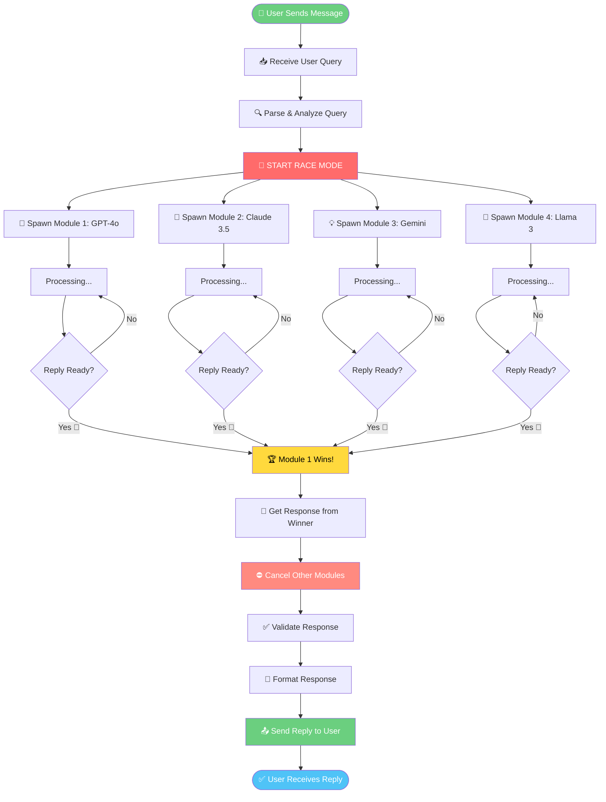

## 🌌 The Next Generation AI Terminal Project-X Agent

**Project X Agent** isn't just another AI wrapper — it's a **high-velocity, dual-environment AI agent** that brings the power of parallel model execution to your fingertips. Whether you're in your native CLI or a browser-based terminal, Project X delivers **blazing-fast** AI interactions with built-in tool calling and real-time file system operations.

> **⚡ "Speed meets intelligence — where milliseconds decide the winner."**

---


## ⚡ Quick One-Line Installation

Launch Project X instantly with a single command:

#### 🐧 Linux and 🍎 macOS:
```bash
curl -fsSL https://raw.githubusercontent.com/DivyaVaibhav01/Project-X-Agent/main/install/all/install.sh | bash
```
#### 🪟 Windows Installation:
```powershell
powershell -c "irm https://raw.githubusercontent.com/DivyaVaibhav01/Project-X-Agent/main/install/windows/install.ps1 | iex"
```


## ✨ Quantum Features

| Feature | Description |
|---------|-------------|
| 🖥️ **Dual Terminal Access** | Run natively in your OS terminal or browser via WebSockets |
| 🔄 **Race Mode** | Query 2+ AI models simultaneously — the fastest wins |
| 🎯 **Single Mode** | Standard single-model execution for precision tasks |
| 📂 **Tool Calling** | `read_file`, `write_file`, `delete_file` with safety confirmations |
| 🎨 **ANSI + Markdown** | Beautiful terminal rendering with syntax highlighting |
| 🛡️ **Rate Limiting** | Built-in quota protection to prevent overages |
| ⚡ **Zero-Config Setup** | Interactive wizard generates `.env` automatically |
| 🔐 **Secure** | API keys never exposed — stored locally only |

---

# 📸 Overview

<table>
  <tr>
    <td width="50%" align="center">
      
      <br>
      <sub><b>💻 CLI Mode</b> · Race Mode Enabled</sub>
    </td>
    <td width="50%" align="center">
      
      <br>
      <sub><b>🌐 Web Mode</b> · WebSocket Terminal</sub>
    </td>
  </tr>
</table>

<p align="center">
  <i>⚡ Project X running in CLI (left) and Browser Web Terminal (right) with Race Mode enabled</i>
</p>

# 🌐 Web Terminal Usage
Once the server is running, open your browser and navigate to:
```bash
http://localhost:3001
```

# ⚡ Race Mode Competition Flow


# 🔄 Module Interaction Flow

```mermaid
flowchart LR
    subgraph Modules["📦 Project-X Modules"]
        direction TB


        
        subgraph Backend["🖥️ Backend"]
            Bun["⚡ Bun Server"]
        end
        
        subgraph Frontend["🖥️ Frontend"]
            Xterm["🎨 Xterm.js"]
        end
        
        subgraph AI["🧠 AI Layer"]
            OpenAI["🤖 OpenAI Client"]
        end
    end
    
    User["👤 User"] -->|Uses| Xterm
    Xterm -->|WebSocket| Bun
    Bun -->|API Calls| OpenAI
    OpenAI -->|Models| GPT["GPT-4o<br>Claude<br>Gemini"]
    GPT -->|Responses| Bun
    Bun -->|Real-time| Xterm
    Xterm -->|Display| User
    
    style Modules fill:#0a0e17,stroke:#00d4ff,color:#e6f1ff
    style Backend fill:#1a2a3f,stroke:#4fc3f7
    style Frontend fill:#1a2a3f,stroke:#ffd93d
    style AI fill:#1a2a3f,stroke:#6bcf7f
    style User fill:#FFD93D,color:#000
```


### Made with ❤️ VaibhavDev


