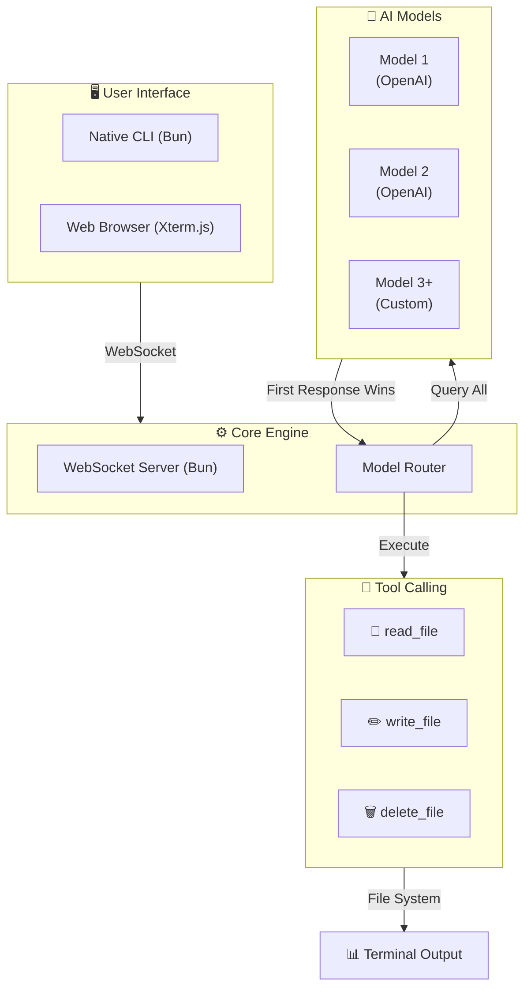

<div align="center">

<!-- Animated Gradient Header -->


<!-- Glowing Neon Badges -->
<p>
  
  
  
  
  
</p>

<!-- Glowing ASCII Art -->
<pre style="color: #00ff88; text-shadow: 0 0 20px #00ff88, 0 0 40px #00ff88;">
██████╗ ██████╗  ██████╗  ██╗███████╗██╗  ██╗████████╗
██╔══██╗██╔══██╗██╔═══██╗██║██╔════╝╚██╗██╔╝╚══██╔══╝
██████╔╝██████╔╝██║   ██║██║█████╗   ╚███╔╝    ██║   
██╔═══╝ ██╔══██╗██║   ██║██║██╔══╝   ██╔██╗    ██║   
██║     ██║  ██║╚██████╔╝██║███████╗██╔╝ ██╗   ██║   
╚═╝     ╚═╝  ╚═╝ ╚═════╝ ╚═╝╚══════╝╚═╝  ╚═╝   ╚═╝   
</pre>

<p align="center">
  
  
  
</p>

### 🚀 Web-Based AI Terminal with Parallel Model Execution

[](https://your-demo-link.com)
[](https://docs.your-project.com)
[](https://discord.gg/your-invite)

</div>

---

<!-- Gradient Divider -->


## 🌌 The Next Generation AI Terminal

> **⚡ "Speed meets intelligence — where milliseconds decide the winner."**

**Project X** isn't just another AI wrapper — it's a **high-velocity, dual-environment AI agent** that brings the power of parallel model execution to your fingertips. Whether you're in your native CLI or a browser-based terminal, Project X delivers **blazing-fast** AI interactions with built-in tool calling and real-time file system operations.

<div align="center">
  <table>
    <tr>
      <td align="center"><b>⚡ 50-70%</b><br>Faster Responses</td>
      <td align="center"><b>🤖 2+</b><br>Parallel Models</td>
      <td align="center"><b>📂 3</b><br>Built-in Tools</td>
      <td align="center"><b>🌐 2</b><br>Terminal Modes</td>
    </tr>
  </table>
</div>

---

## ✨ Quantum Features

<div align="center">
  <table>
    <tr>
      <td align="center" width="33%">
        <h3>🖥️ Dual Terminal Access</h3>
        <p>Run natively in your OS terminal <br>or browser via WebSockets</p>
      </td>
      <td align="center" width="33%">
        <h3>🔄 Race Mode</h3>
        <p>Query 2+ AI models simultaneously <br>— <b>the fastest wins</b></p>
      </td>
      <td align="center" width="33%">
        <h3>🎯 Single Mode</h3>
        <p>Standard single-model execution <br>for precision tasks</p>
      </td>
    </tr>
    <tr>
      <td align="center">
        <h3>📂 Tool Calling</h3>
        <p><code>read_file</code> · <code>write_file</code> · <code>delete_file</code> <br>with safety confirmations</p>
      </td>
      <td align="center">
        <h3>🎨 ANSI + Markdown</h3>
        <p>Beautiful terminal rendering <br>with syntax highlighting</p>
      </td>
      <td align="center">
        <h3>🛡️ Rate Limiting</h3>
        <p>Built-in quota protection <br>to prevent overages</p>
      </td>
    </tr>
    <tr>
      <td align="center">
        <h3>⚡ Zero-Config Setup</h3>
        <p>Interactive wizard generates <br><code>.env</code> automatically</p>
      </td>
      <td align="center">
        <h3>🔐 Secure</h3>
        <p>API keys never exposed <br>— stored locally only</p>
      </td>
      <td align="center">
        <h3>📊 Real-time Streaming</h3>
        <p>Live response streaming <br>with WebSocket connection</p>
      </td>
    </tr>
  </table>
</div>

---

<!-- Gradient Divider -->


## 🎬 Sneak Peek

<div align="center">

### ⚡ CLI Terminal — Race Mode in Action


*⚡ Two models competing — the fastest response wins!*

<br>

### 🌐 Web Terminal — Browser-Based Access


*🌐 Full-featured terminal in your browser via WebSockets*

</div>

---

## 🛸 Quick Start

### Prerequisites

<div align="center">
  
</div>

**Install Bun (if not already present):**

```bash
# 🍎 macOS / Linux / WSL
curl -fsSL https://bun.sh/install | bash

# 🪟 Windows (Powershell)
powershell -c "irm bun.sh/install.ps1 | iex"

# ✅ Verify installation
bun --version

## 🌌 The Next Generation AI Terminal

**Project X Agent** isn't just another AI wrapper — it's a **high-velocity, dual-environment AI agent** that brings the power of parallel model execution to your fingertips. Whether you're in your native CLI or a browser-based terminal, Project X delivers **blazing-fast** AI interactions with built-in tool calling and real-time file system operations.

> **⚡ "Speed meets intelligence — where milliseconds decide the winner."**

---

## ✨ Quantum Features

| Feature | Description |
|---------|-------------|
| 🖥️ **Dual Terminal Access** | Run natively in your OS terminal or browser via WebSockets |
| 🔄 **Race Mode** | Query 2+ AI models simultaneously — the fastest wins |
| 🎯 **Single Mode** | Standard single-model execution for precision tasks |
| 📂 **Tool Calling** | `read_file`, `write_file`, `delete_file` with safety confirmations |
| 🎨 **ANSI + Markdown** | Beautiful terminal rendering with syntax highlighting |
| 🛡️ **Rate Limiting** | Built-in quota protection to prevent overages |
| ⚡ **Zero-Config Setup** | Interactive wizard generates `.env` automatically |
| 🔐 **Secure** | API keys never exposed — stored locally only |

---

## 🧠 How It Works

### Architecture Flow




## 📸 Overview


*Project X running directly in the CLI terminal with Race Mode enabled.*


*Project X running via WebSockets in the browser web terminal.*

## 📋 Prerequisites

You must have **[Bun](https://bun.sh)** installed on your machine before running this project.

### Installing Bun

**macOS / Linux / WSL:**
```bash
curl -fsSL https://bun.sh/install | bash
```

## Windows (Powershell):
```bash
powershell -c "irm bun.sh/install.ps1 | iex"
```

## Verify installation:
```bash
bun --version`
```


## ⚡ Quick One-Line Installation

Install Bun (if missing), clone the repository, set up dependencies, and launch Project X instantly with a single command:

```bash
curl -fsSL https://raw.githubusercontent.com/DivyaVaibhav01/Project-X-Agent/main/install.sh | bash

```


# 🌐 Web Terminal Usage
Once the server is running, open your browser and navigate to:
```bash
http://localhost:3001
```
You can execute prompts, interact with the agent, manage local files, and type exit or quit to end your session


# 🛠️ Built With

| Technology | Logo / Badge |
|------------|--------------|
| **Runtime & Server** |  |
| **Frontend Terminal** |  |
| **AI Provider Client** |  |

---

### 📦 Detailed Versions

- **Bun** – JavaScript runtime & package manager  
- **Xterm.js** – Terminal emulator for the browser  
- **OpenAI Node SDK** – Official Node.js client for OpenAI APIs
- 


