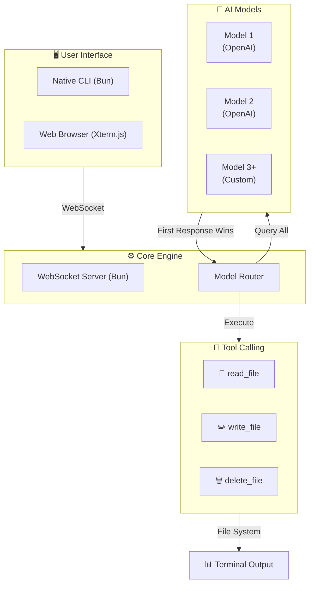

## 🌌 The Next Generation AI Terminal Project-X Agent

**Project X Agent** isn't just another AI wrapper — it's a **high-velocity, dual-environment AI agent** that brings the power of parallel model execution to your fingertips. Whether you're in your native CLI or a browser-based terminal, Project X delivers **blazing-fast** AI interactions with built-in tool calling and real-time file system operations.

> **⚡ "Speed meets intelligence — where milliseconds decide the winner."**

---


## ⚡ Quick One-Line Installation

Launch Project X instantly with a single command:

#### 🐧 Linux and 🍎 macOS Installation...
```bash
curl -fsSL https://raw.githubusercontent.com/DivyaVaibhav01/Project-X-Agent/main/install/all/install.sh | bash
```
#### 🪟 Windows Installation...
```powershell
powershell -c "irm https://raw.githubusercontent.com/DivyaVaibhav01/Project-X-Agent/main/install/windows/install.ps1 | iex"
```


## ✨ Quantum Features

| Feature | Description |
|---------|-------------|
| 🖥️ **Dual Terminal Access** | Run natively in your OS terminal or browser via WebSockets |
| 🔄 **Race Mode** | Query 2+ AI models simultaneously — the fastest wins |
| 🎯 **Single Mode** | Standard single-model execution for precision tasks |
| 📂 **Tool Calling** | `read_file`, `write_file`, `delete_file` with safety confirmations |
| 🎨 **ANSI + Markdown** | Beautiful terminal rendering with syntax highlighting |
| 🛡️ **Rate Limiting** | Built-in quota protection to prevent overages |
| ⚡ **Zero-Config Setup** | Interactive wizard generates `.env` automatically |
| 🔐 **Secure** | API keys never exposed — stored locally only |

---

## 🧠 How It Works

### Architecture Flow




## 📸 Overview


*Project X running directly in the CLI terminal with Race Mode enabled.*


*Project X running via WebSockets in the browser web terminal.*

# 🌐 Web Terminal Usage
Once the server is running, open your browser and navigate to:
```bash
http://localhost:3001
```
You can execute prompts, interact with the agent, manage local files, and type exit or quit to end your session


 🛠️ Built With

| Technology | Logo / Badge |
|------------|--------------|
| **Runtime & Server** | [](https://bun.sh) |
| **Frontend Terminal** | [](https://xtermjs.org) |
| **AI Provider Client** | [](https://openai.com) |

### 📦 Detailed Versions

- **Bun** – JavaScript runtime & package manager  
- **Xterm.js** – Terminal emulator for the browser  
- **OpenAI Node SDK** – Official Node.js client for OpenAI APIs


### Made with ❤️ VaibhavDev


